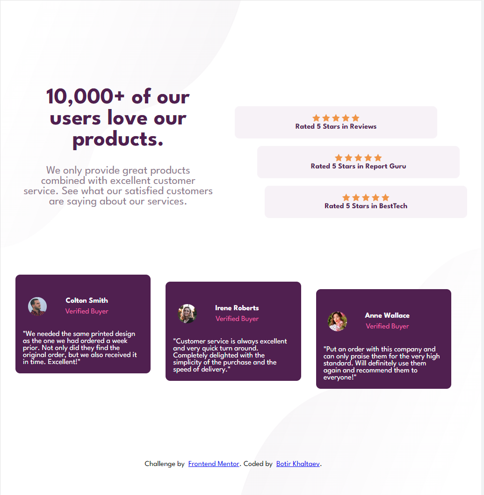
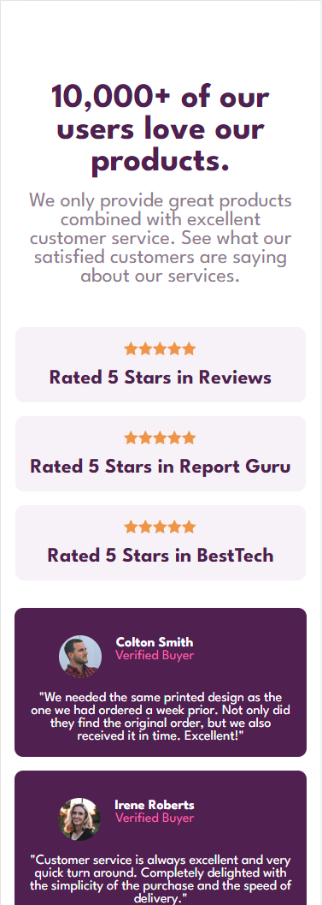

# Social Proof Section

This is a solution to the Social Proof Section challenge on Frontend Mentor. It is a webpage that showcases customer reviews and ratings for a product or service.

## Table of Contents

- [Overview](#overview)
  - [The Challenge](#the-challenge)
  - [Screenshot](#screenshot)
  - [Links](#links)
- [Built With](#built-with)
- [Features](#features)
- [Usage](#usage)
- [Code Highlights](#code-highlights)
- [Useful Resources](#useful-resources)
- [Author](#author)
- [Acknowledgments](#acknowledgments)

## Overview

### The Challenge

The challenge was to create a responsive social proof section that displays customer reviews and ratings. The layout should adapt to different screen sizes.

### Screenshot

#### Desktop



#### Mobile




### Links

- Solution: [Solution URL](https://github.com/botirk38/social-proof-section-master)
- Live Demo: [Live Demo](https://botirk38.github.io/social-proof-section-master/)

## Built With

- HTML5
- CSS3

## Features

- Responsive design
- Customer reviews with ratings
- Background images

## Usage

To view the webpage, you can follow these steps:

1. Clone the repository: `git clone https://github.com/your-username/your-repo.git`
2. Open the `index.html` file in a web browser.

Feel free to customize the code and make any improvements or modifications as needed.

## Code Highlights

One part of the code that I'm proud of is the CSS styling for the customer review boxes. Here's an example of the CSS code:

```css
.customer-review {
  color: var(--white);
  font-size: var(--p-font-size);
}
```

## Useful Resources

Here are some resources that I found helpful while working on this project:

- [Frontend Mentor](https://www.frontendmentor.io) - A great platform for practicing front-end coding skills with real-world challenges.
- [MDN Web Docs](https://developer.mozilla.org) - An extensive documentation resource for HTML, CSS, and JavaScript.
- [CSS-Tricks](https://css-tricks.com) - A website with tutorials, articles, and examples for CSS.

## Author

- [Your Name](https://your-website.com)
- [Frontend Mentor](https://www.frontendmentor.io/profile/your-username)
